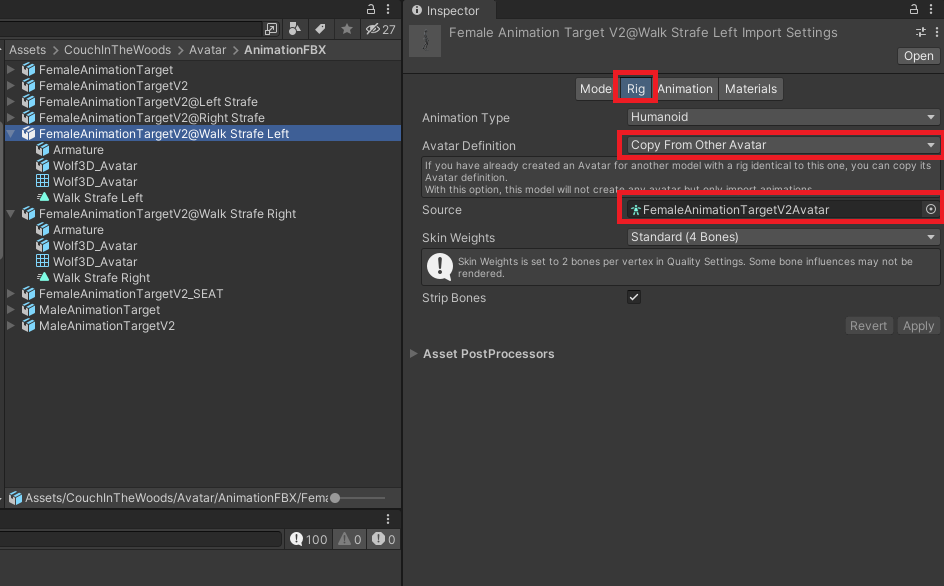
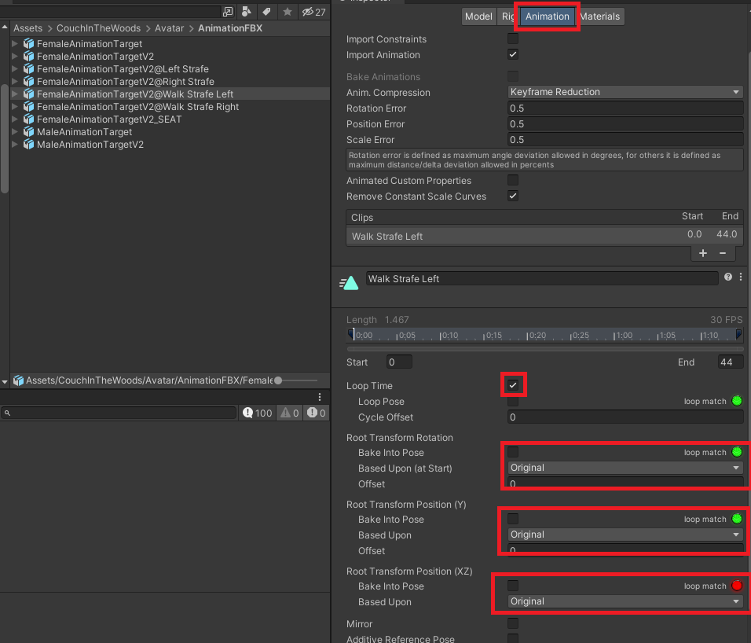
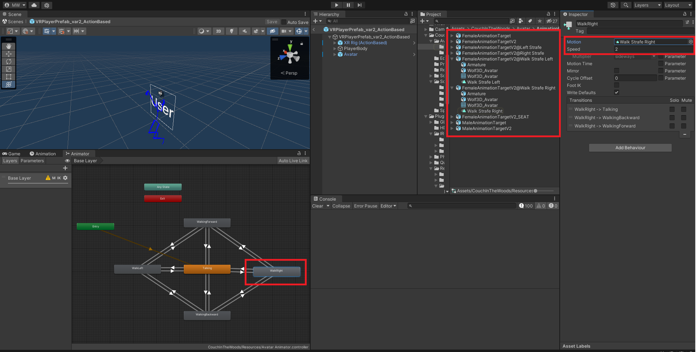

<!-- Improved compatibility of back to top link: See: https://github.com/othneildrew/Best-README-Template/pull/73 -->
<a name="readme-top"></a>
<!--
*** Thanks for checking out the Best-README-Template. If you have a suggestion
*** that would make this better, please fork the repo and create a pull request
*** or simply open an issue with the tag "enhancement".
*** Don't forget to give the project a star!
*** Thanks again! Now go create something AMAZING! :D
-->


# Animation

All Playeranimations are downloaded from Mixamo. If you want to add new animations, you have to follow these steps:

#### Download new animations

1. Goto [Mixamo](https://www.mixamo.com/#/)
2. On the right side you can see the "Upload Character" Button
3. Now we need our Character for auto rig from the following folder ``` Assets\CouchInTheWoods\Avatar\AnimationFBX\ ```
4. Pick the ```FemaleAnimationTargetV2.fbx``` from the explorer and upload it to mixamo
5. Now Mixamo will load the FBX to the auto-rigger
6. Press "NEXT" twice, and now you can choose your animation
7. For example type: "walk left strafe" and select it 
8. Now press "DOWNLOAD" or adjust the animation for your wishes
9. Now you can see the Download Pop-Up. Here it's important to change the format to: ```FBX For Unity(.fbx)```!
10. Now press download and drop the file in our "AnimationFBX"-folder

#### Import new animations into Project


1. After you drop the fbx into unity, now search in in project folder and open inspector
2. Now go to tab "Rig" and press "Avatar Definition" to: "Copy From Other Avatar" <a href="#Image1">Image 1</a>
3. To Source we have to add our `FemaleAnimationTargetVRAvatar`
4. Convert Units: off
5. Read/Write: on
6. Hit apply 
7. Now GoTo: Animation Tab <a href="#Image2">Image 2</a>
8. Loop Time: on 
9. Root Transform Rotation: Orginal
10. Root Transform Position(Y): Orginal
11. Root Transform Position(XZ): Orginal


#### Image 1
<div align="center">  
    <a name="Image1"></a>
    
  
</div>

#### Image 2
<div align="center">  
    <a name="Image2"></a>
    
  
</div>


#### Add animations to Controller


1. Go to Project Hierarchy
2. Search for the `VRPlayerPrefab_var2_ActionBased`
3. Open Prefab
4. GoTo Avatar in Hierarchy
5. Now Open the Animator Tab (Make sure you opend it or GoTo Menu/Animation/Animator)
6. Now you should see the Walk Animation Tree <a href="#Image3">Image 3</a>
7. Since we choose a "Left Walk Animation" now we need to add it, so click on the "WalkLeft" State
8. Now in the Inspector you should see the WalkLeft State
9. Now we wanna add our new Motion: press the little circle right from it 
10. The AnimationFBX folder should automatically open
11. GoTo your new FBX and expand it
12. Drag & Drop the new animation into our state
13. It can be necessary to adjust the animation speed 
14. Now run the project and see your new animation!


#### Image 3
<div align="center">  
    <a name="Image3"></a>
    
  
</div>


<hr>


[Back to Readme](README.md)

