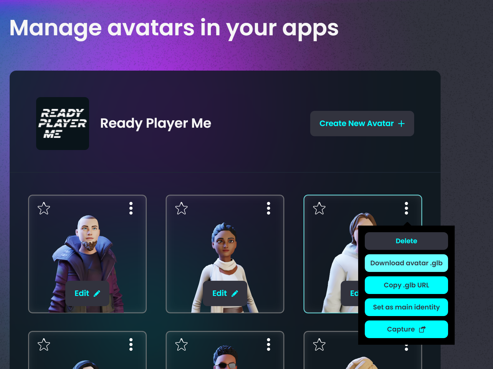
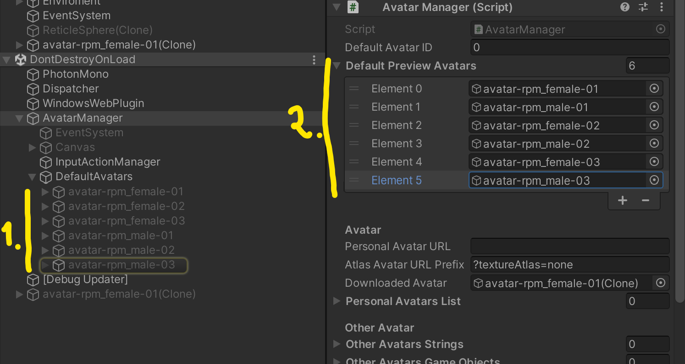

<!-- Improved compatibility of back to top link: See: https://github.com/othneildrew/Best-README-Template/pull/73 -->

<!--
*** Thanks for checking out the Best-README-Template. If you have a suggestion
*** that would make this better, please fork the repo and create a pull request
*** or simply open an issue with the tag "enhancement".
*** Don't forget to give the project a star!
*** Thanks again! Now go create something AMAZING! :D
-->

# Default Avatars

Default Avatars are needed in case that players don't want to create a custom avatar. Default Avatars are included in the build and thus don't need to be donwnloaded.

#### Download new Avatars from Ready Player Me

1. Go to https://readyplayer.me/de/hub 
2. Create a new Character
3. Download the avatar as .glb file (Maybe you have to be logged in for that)

  
    
    

#### Implement new Default Avatars

1. Go to the lobby scene
2. Find the AvatarManager and open the prefab
3. Drop the glb file beneath the Default Avatars Object
4. Add the object to the avatarManager list

  
    
    

[Back to Readme](README.md)

