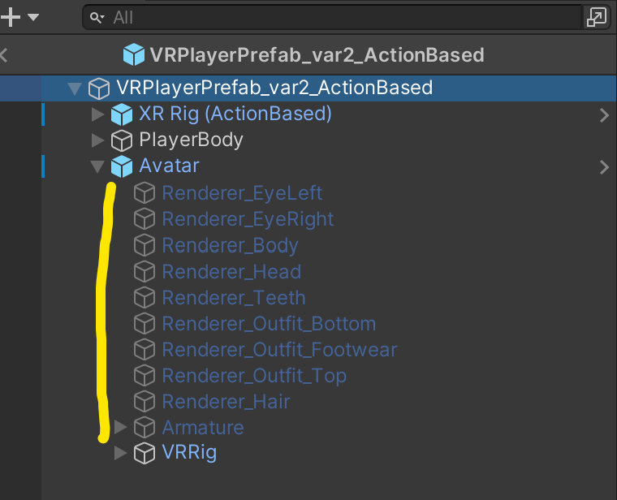

<!-- Improved compatibility of back to top link: See: https://github.com/othneildrew/Best-README-Template/pull/73 -->

<!--
*** Thanks for checking out the Best-README-Template. If you have a suggestion
*** that would make this better, please fork the repo and create a pull request
*** or simply open an issue with the tag "enhancement".
*** Don't forget to give the project a star!
*** Thanks again! Now go create something AMAZING! :D
-->

# Feature Scope & Implementation

Default Avatars are needed in case that players don't want to create a custom avatar. Default Avatars are included in the build and thus don't need to be donwnloaded.

## Proposal Features

### **1. Schaffung eines UI zur Verbindung mit einer Webseite ReadyPlayerMe**

Implemented and updated the Vuplex Plugin. The Webview will open on "Create Avatar" in the lobby.
The Vuplex PlugIn is only compatible with Windows applications. On Android Devices the "Create Avatar" button is disabled.

For Android VR you need to buy the additional plugin pack from Vuplex: https://store.vuplex.com/webview/android-gecko

### **2. Herunterladen von Avataren aus der Webseite**

When the "next" button in the Ready Player Me  Webview is pressed, the Avatar gets downloaded.
The following scripts handle the download of Avatars:
RPMAvatarWebviewLoader.cs
AvatarManager.cs

### **3. Implementieren der Avatare in das derzeitige XR-Rig**

The downloaded Avatar files are processed at runtime and parsed into the existing rig. For this, all the mesh files and the Armature are replaced with the new ones.
To get the avatar working properly, the following scripts are handling different things:
* AvatarNetworkSync.cs: Handle the download of remote characters
* AvatarMeshUpdater.cs: Handles the mesh replacement and rebinds the Animator Armature
* VRRigAvatarMapper.cs: Remappes the Rig for movement and tracking

  
    
    

We decided to not show the Avatar mesh for the first person player due to following reasons:
* Hand tracking is never perfectly mapped on the avatar hands which makes interactions difficult, like pointer.
* People differ in body size, so they will never be in the right place for the mesh
* Avatar mesh tends to clip in the players view
* Avtar mesh tends to deform heavily on specific hand rotations
* Heavy problems when sitting. It's not possible to get the player mapped on the sitting character. Fixed position will result in motion sickness and weird arm movement. Free position tracking will result in clipping through avatar mesh and viewing it from different angles

### **4. Fehlerfreie Synchronisation sicherstellen von Avataren zwischen allen Clients**

If a player enters a room, all other players will see the avatar presentation of the player. This could be a default avatar, in this case the avatar is shown instantly.
If the player chose a custom avatar, a default avatar gets shown first and when the custom avatar got downloaded it will replace afterwards.

All movement animations and head/hand tracking positions get synced properly.

### **5. Testen und Beheben von Netzwerkproblemen bei der Verwendung von Photon PUN2**

We solved some issues with double loading Photon rooms and loading rooms via update which results in game breaking errors on Android.
We tested with multiple clients on Android Oculus Quest and Windows Valve Index. Syncronization and player representation worked fine.

### **6. Der Vorgang sollte sowohl für VR, als auch für Desktop und mobile Apps (Android) funktionieren**

Unity changed from HDRP to URP due to incompatibility with Android VR devices and performance issues.
The build worked stable on Android Oculus Quest and Windows Valve Index. For the Android versions, the webview won't work as explained before.

### **7. Dokumentation der Prozesse wie angeboten**

See this file

### **8. Behebung von Konflikten zwischen den Pulgins, XR Interfaces, Toolkit, Open XR, Photon PUN2, ReadyPlayerMe SDR**

All plugins are installed properly and work together as they should.

## Additional Features

* Project cleanup and restructure
* Unity Version changed due to some incompatibility issues with plugins
* Unity changed from HDRP to URP due to incompatibility with Android VR devices and performance issues.
* Reworked the whole XR-Rig-Input System to Action based due to better compatibility with multiple devices and flexible input setup.
* Environment light setup and performance tweaks (neccessary to get it working properly on Android devices).
* Additional Avatar Animation: Walking, Sitting
* Sitting feature, that players can interact with furniture to sit on and the avatar switches to seat position and gets synced.
* Implemented Outline Shader
* Minor adjustements & improvements
    * removed blue hands duplicates
    * Pointer renderer adjusted in color and length
    * Removed duplicate Photon Transform syncs
    * Fixed duplicate Lobby load
    * Mirrored mirror image to display reflected images correctly
    * Adjusted mirror cam layer mask to show avtars but not for first person camera

[Back to Readme](README.md)

