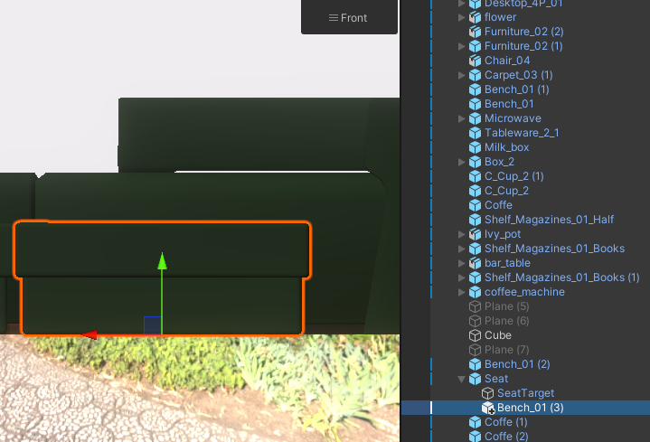
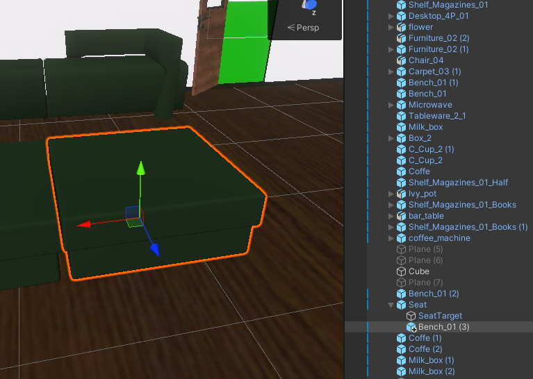
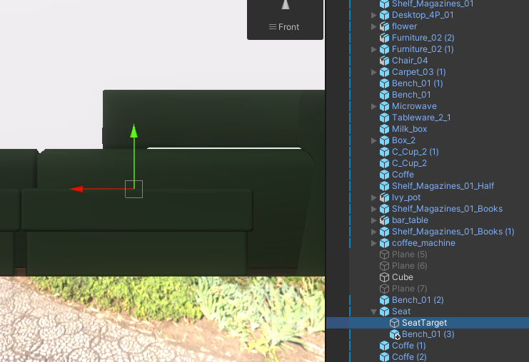
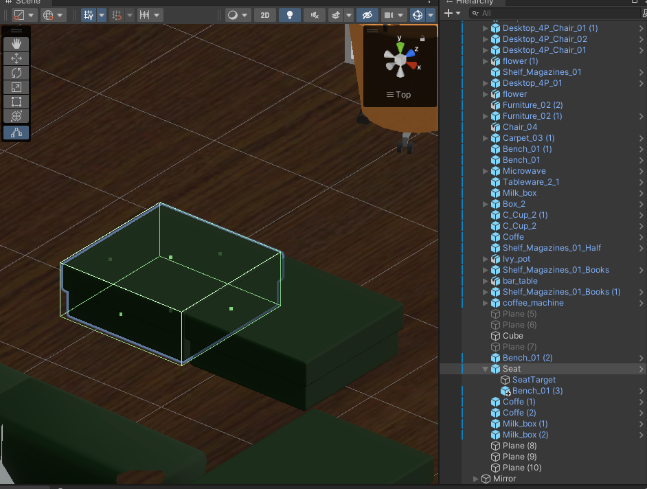

<!-- Improved compatibility of back to top link: See: https://github.com/othneildrew/Best-README-Template/pull/73 -->

<!--
*** Thanks for checking out the Best-README-Template. If you have a suggestion
*** that would make this better, please fork the repo and create a pull request
*** or simply open an issue with the tag "enhancement".
*** Don't forget to give the project a star!
*** Thanks again! Now go create something AMAZING! :D
-->

# CREATE A NEW SEAT TARGET

Virtual Campus comes with the option to seat your avatar on every seat you want. What we need for this, is a little prefab where wit can find in the project folder `Assets\CouchInTheWoods\Prefabs` under the name: `Seat`. Everything you need to do is:

* Drop the Prefab into your scene
* Set the position to the position of your seat you want to make seatable (see: <a href="#SeatPosition">SeatPosition</a>)
* Now set your seat mesh as child of the Seat (see: <a href="#Hierarchy">Hierarchy</a>)
* As another child there allready exists the SeatTarget - this is the exactly position where the player will sitting
* Position the SeatTarget to the seating surface (see: <a href="#SeatTargetPosition">SeatTargetPosition</a>)
* If your seat don't have a collider optimize the collider on the seat prefab. The outline script will take the mesh collidor below it's self for hovering (see: <a href="#Collider">Collider</a>)
  

#### SeatPosition

  
    
    
  

#### Hierarchy

  
    
    
  

#### SeatTargetPosition

  
    
    
  

#### Collider Position

  
    
    
  

[Back to Readme](README.md)

